.. TODO
.. would-be-nice new GIFs:
.. * enf (removed default parameter to exception)
.. * fun (use spn)
.. * this (use spn)
.. * thr (param list now empty by default)
.. * class (use spn)
.. * opDis (empty param list)
.. * every snippet that uses ${0} (which is pretty much... every snippet)

========================================
DSnips - better UltiSnips snippets for D
========================================

DSnips is a collection of `UltiSnips <https://github.com/SirVer/ultisnips>`_ snippets
for the D programming language. UltiSnips is a snippets plugin for `Vim
<http://vim.org>`_

A few examples of what snippets can do:

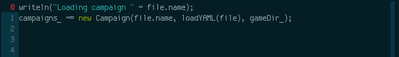

   fore_

----

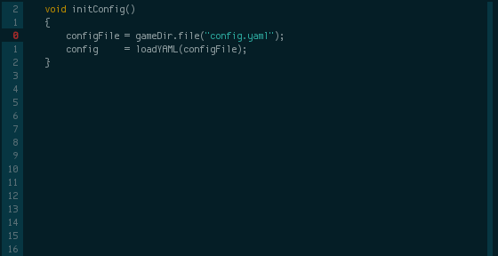

   try_ + thr_ + catch_ + if_

----

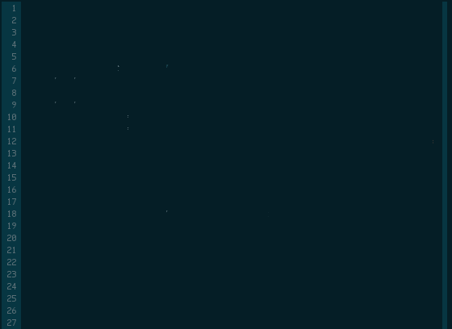

   class_ + priv_ + pub_ + this_ + fun_ + fore_

---------------
Getting Started
---------------

* `Install UltiSnips <https://github.com/SirVer/ultisnips#quick-start>`_

* Get DSnips: ``git clone https://github.com/kiith-sa/DSnips.git``

* Copy the ``d.snippets`` file to UltiSnips user snippets directory. On Linux this
  should be ``~/.vim/UltiSnips``.

  If you don't know where the user snippets directory is, open a D file and type the
  ``:UltiSnipsEdit`` command (after UltiSnips is installed); this will open a user
  ``d.snippets`` file which you can replace by the DSnips version of ``d.snippets``.

As the sheer number of snippets here may be a bit overwhelming, here is a small(ish)
list of snippets that should provide a quick improvement for most people:

==================================================== ===================
*assert* / *enforce*                                 as_ / enf_
(wrap in) *if* / *else if* / *else*                  if_ / elif_ / else_
*for* / *foreach*                                    for_ / fore_
*writeln*                                            wr_
*return*                                             ret_
(wrap in) *scope* guard                              scope_
(wrap in) *try/catch* / *throw* / define *Exception* try_ / thr_ / exc_
*module* header / *import*                           module_ / imp_
getter / setter                                      get_ / set_
define a function                                    fun_
*constructor*                                        this_
*switch* / *case*                                    sw_ / case_
string *mixin*                                       smix_
DDoc *Params:* / *Returns:*                          Par_ / Ret_
==================================================== ===================

Various other snippets may save time depending on which D features you use most, see
Reference_.

.. _wrap:

Code wrapping
^^^^^^^^^^^^^

Some snippets (if_, try_, etc.) can be used to wrap code using the visual placeholder
feature of UltiSnips. To wrap code, select the code you want to wrap (using visual
mode), and press the UltiSnips expand trigger. This will delete the code to insert it
the next time you expand a snippet.

----------
Background
----------

This is a heavily modified version of default UltiSnips D snippets which I made some
time ago. Unfortunately, some snippets specific for my projects as well as some
indentation bugs ended up in the default snippets. This is an attempt to revamp those
snippets and eventually get merged back to the default repo.

Compared to the "old" D snippets, some snippets have been removed (project-specific,
snippets that didn't really save keystrokes) and many new snippets were added, to the
point where almost all D features and some very common Phobos features have a snippet.
There should be less bugs and the snippets have been designed to work together
(``try``/``catch``, ``sw``/``case``, ``import`` chains etc.), save even more keystrokes,
work with new D features etc.

The number of snippets may seem a bit overkill; a lot of that is due to operator
snippets which are similar but always a bit too different to be joined, DDoc and some
rather verbose interpolation code which I prefer to write in a readable way instead of
clever one-liners.

---------
Reference
---------

Sections
^^^^^^^^

* Phobos_
* Branches_
* Loops_
* `Contracts, asserts, tests`_
* Functions_
* `Exception handling`_
* `Type definitions`_
* `Metaprogramming and conditional compilation`_
* Operators_
* `DDoc and comments`_
* Various_

All snippets
^^^^^^^^^^^^

al_, as_, avar_, bsl_, case_, catch_, class_, cont_, cvar_, do_, doctest_, elif_, else_,
enf_, enum_, Ex_, exc_, for_, fore_, forever_, forif_, format_, fsw_, fun_, get_, gpl_,
if_, ife_, imp_, in_, inter_, invar_, ivar_, main_, module_, new_, opApply_, opAssign_,
opB_, opCall_, opCmp_, opDis_, opDollar_, opIndexAssign_, opIndex_, opO_,
opSliceAssign_, opSlice_, opU_, out_, pack_, Par_, priv_, prot_, pub_, Range_, ret_,
Ret_, scope_, See_, set_, spn_, struct_, supe_, sw_, this_, thr_, Thr_, toStr_, todo_,
try_, tryf_, tup_, union_, utest_, wh_, with_, wr_, wrf_,

----

Phobos
^^^^^^

enf_, format_, tup_, wr_, wrf_

----

``enf``
#######

*std.exception.enforce*

Automatically breaks the snippet into 2 lines if line length exceeds Vim ``textwidth``
(can be set in ``.vimrc``). Can only break the snippet between the 2 parameters to
*enforce*.

``format``
##########

*std.string.format*

   Also in this sample: cvar_

``tup``
#######

*std.typecons.tuple*

   Also in this sample: avar_

.. _wr:
.. _wrf:

``wr``, ``wrf``
###############

*std.stdio.writeln*, *std.stdio.writefln*

Branches
^^^^^^^^

case_, elif_, else_, fsw_, if_, ife_, sw_

----

``if``
######

*if*

Supports code-wrapping_.

----

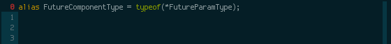

   Wrapping code in a *static if*.

``elif``
########

*else if*

Supports code-wrapping_.

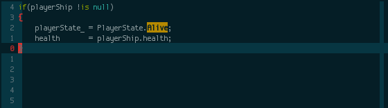

``else``
########

*else*

Supports code-wrapping_.

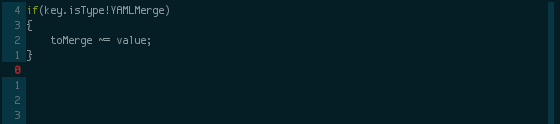

``ife``
#######

*if* followed by *else*

   Used to create a *static if* / *else* pair.
   Also in this sample: ret_

.. _case:
.. _sw:

``sw``, ``case``
################

*switch* and *case*

``sw`` generates a *switch* with two *case*'s and a *default* branch. When done, places
the cursor after the two cases so ``case`` can be used immediately to add more cases.

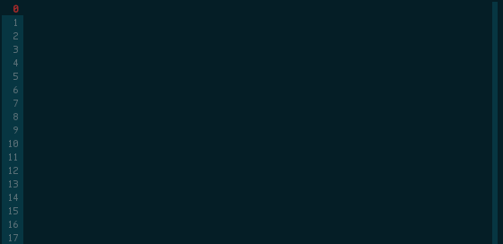

``fsw``
########

*final switch*

Similar to sw_ but generates a *final switch* without a *default*.

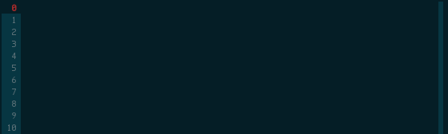

Loops
^^^^^

do_, for_, fore_, forever_, forif_, wh_

----

``do``
######

*do while* loop

Supports code-wrapping_.

``wh``
######

*while* loop

Supports code-wrapping_.

   Also in this sample: if_

``for``
#######

*for* loop

Supports code-wrapping_.

   Also in this sample: tup_, avar_

``fore``
########

*foreach* loop

Supports code-wrapping_.

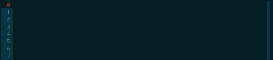

   Also in this sample: if_

----

   Wrapping code in a *foreach* loop.

``forever``
###########

infinite *for* loop

Supports code-wrapping_.

``forif``
#########

*foreach* loop combined with *if* to filter elements

Usually, a better way to do this is to use *std.algorithm.filter* but it is (at least
with current Phobos/DMD) sometimes easier/more readable to write performant code with
a foreach/if combination.

Supports code-wrapping_.

Contracts, asserts, tests
^^^^^^^^^^^^^^^^^^^^^^^^^

as_, doctest_, in_, invar_, out_, utest_

----

``as``
######

*assert*

The 2-parameter version of assert is used by default as it's usually good practice to
write that description string even if the assert may sem obvious.

Automatically breaks the snippet into 2 lines if line length exceeds Vim ``textwidth``
(can be set in ``.vimrc``). Can only break the snippet between the 2 parameters to
*assert*.

``in``
######

*in* contract

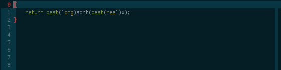

   Also in this sample: as_

``out``
#######

*out* contract

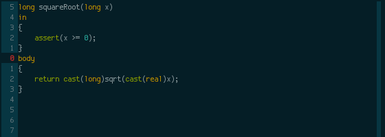

   Also in this sample: as_

``invar``
##########

class/struct *invariant*

   Also in this sample: as_

``utest``
#########

*unittest* block

``doctest``
###########

a documentation *unittest* block

A unitest preceded by *///* will add an example to the DDoc of the previous
function/class/etc.

.. figure:: ./gif/doctest.gif

   Also in this sample: as_

Functions
^^^^^^^^^

get_, fun_, main_, Range_, set_, this_, toStr_

----

``fun``
#######

function/method

``fun`` is one of the more involved snippets. The parameter list is analyzed to generate
a *Params:* DDoc section, although  the parameter's descriptions need to be filled in
manually. The second-to-last tabstop allows to write the one-line DDoc description of
the function and to specify DDoc comment style; starting the description tabstop with
*///* will use *///* DDoc comments while starting with */*** will use */** */*
DDoc comments.

   Notice that we change the documentation comment style by typing */*** in the
   "Description" tabstop.  Also in this sample: fore_

----

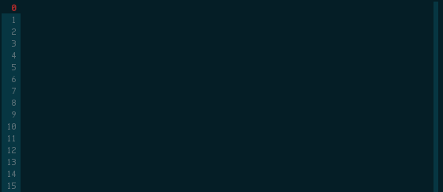

   Also in this sample: forif_, ret_

``this``
########

constructor

Like fun_, generates DDoc comments.

``get``
#######

getter property

@property is not used as it's mostly considered a mistake now and may be deprecated in
future.

   By default, the generated getter returns a field with the getter's' name suffixed by
   '_'.

----

   In this sample, the return expression is rewritten and doesn't even correspond to
   a field.

``set``
#######

setter property

   Similarly to get_, by default a setter sets a field with the setter's name
   suffixed by '_'.  Also in this sample: as_

``main``
########

the *main()* function

   Also in this sample: wr_

.. _Range:

``Range`` / ``InputRange``
##########################

*InputRange* methods

Many D types have range-style interfaces, of which *InputRange* is the most common
subset. ``Range`` generates *InputRange* API stubs which can be filled in with its
tabstops.

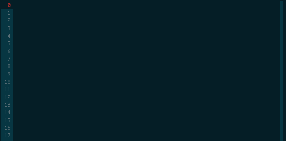

``toStr``
#########

*toString()* method

   Also in this sample: ret_, spn_

Exception handling
^^^^^^^^^^^^^^^^^^

catch_, thr_, try_, tryf_

----

.. _try:
.. _catch:
.. _thr:

``try``, ``catch``, ``thr``
###########################

*try*/*catch* block, *catch* block, *throw* statement

Supports code-wrapping_.

   ``try`` is used to wrap 2 lines in a *try*/*catch* block, ``thr`` to throw exception
   from *catch* and ``catch`` to add another *catch* block.
   Also in this sample: if_

``tryf``
########

*try*/*catch*/*finally* block

Supports code-wrapping_.

   Also in this sample: wr_

Type definitions
^^^^^^^^^^^^^^^^

al_, class_, enum_, exc_, inter_, struct_, union_

----

``class``
#########

*class* definiton

The default class name is the source file name with uppercased first character.

   Also in this sample: priv_, pub_, this_, fun_, fore_

``struct``
##########

*struct* definition

The default name of the *enum*/*interface*/*union* is determined similarly to class_.

   Also in this sample: priv_, pub_

.. _enum:
.. _union:
.. _inter:

``enum``, ``inter``, ``union``
##############################

*enum*, *interface*, *union* definitions

The default name of the *enum*/*interface*/*union* is determined similarly to class_.

``al``
######

type *alias*

``exc``
#######

*Exception class* definition

Creates a new exception type with a constructor taking a string, and implicitly taking
the caller's source file and line.

Metaprogramming and conditional compilation
^^^^^^^^^^^^^^^^^^^^^^^^^^^^^^^^^^^^^^^^^^^

debug_, mix_, smix_, template_, version_

``mix``
########

*mixin* statement

``smix``
#########

string *mixin* expression

Creates a 'macro-like' string mixin using
`std.string.format <http://dlang.org/phobos/std_string.html#.format>`_ to insert
values into the mixin at compile-time.

   Also in this sample: cvar_

``debug``
#########

*debug* block

Supports code-wrapping_.

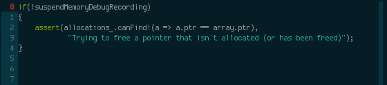

``version``
############

*version* block

Supports code-wrapping_.

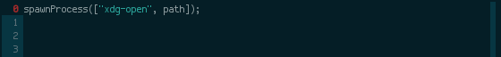

``template``
############

A plain template (not a template class/function) Like fun_, generates DDoc comments.

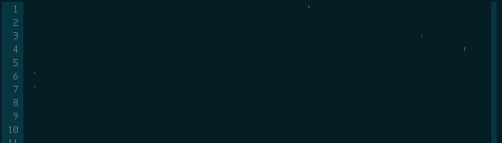

   Also in this sample: al_

.. _operators:

Operators
^^^^^^^^^

opApply_, opAssign_, opB_, opCall_, opCmp_, opDis_, opDollar_, opIndexAssign_, opIndex_,
opO_, opSliceAssign_, opSlice_, opU_

----

``opDis``
#########

*opDispatch*

Like fun_, generates DDoc comments for parameters (if any).

   Also in this sample: ret_

.. _opAssign:

``op=`` / ``opAssign``
######################

*opAssign* (the *=* operator)

   Also in this sample: spn_

.. _opDollar:

``op$`` / ``opDollar``
######################

*opDollar* (the *$* operator)

   Also in this sample: ret_

.. _opSlice:

``op[..]`` / ``opSlice``
########################

*opSlice* (operator to get a slice of a container)

Checks that the number of parameters is 0 or 2.

   ``op[..]`` used to create both a bounded *opSlice* (a[1 .. 3]) and "entire container"
   *opSlice* (a[]).
   Also in this sample: ret_, spn_

.. _opIndex:

``op[]`` / ``opIndex``
######################

*opIndex* (operator to get an element of a container)

Checks that there is at least 1 parameter.

   ``op[]`` used to create a single-parameter and two-parameter *opIndex*
   Also in this sample: ret_

.. _opSliceAssign:

``op[..]=`` / ``opSliceAssign``
###############################

*opSliceAssign* (operator to assign to a slice of a container)

Checks that the number of parameters is 1 or 3.

.. _opIndexAssign:

``op[]=`` / ``opIndexAssign``
#############################

*opIndexAssign* (operator to set an element of a container)

Checks that there are at least 2 parameters.

.. _opCall:

``op()`` / ``opCall``
#####################

*opCall* (function call operator)

Like fun_, generates DDoc comments for parameters.

.. figure:: ./gif/opCall.gif

   Also in this sample: ret_

``opB``
#######

*opBinary* (binary operators such as *+*, *in* and *>>*)

Generates an *opBinary* with a *static if* chain to overload all operators specified in
a string that is the first tabstop.  E.g. ``+-in`` will overload operators *+*, *-* and
*in*, while ``^^^`` will overload *^* and *^^*. Checks that the string only contains
valid operators and contains no duplicates.

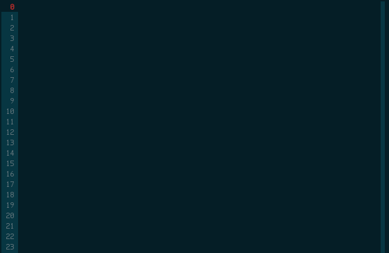

   ``opB`` used to overload operators *+*, *~*, *^^* and *^*

``opU``
#######

*opUnary* (unary operators such as *-*, *++* and *~*)

Same as opB_, but for unary operators.

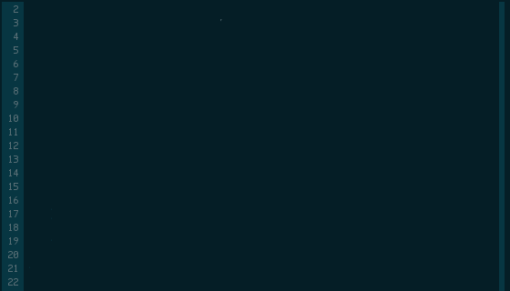

   ``opU`` used to overload operators *-*, *+*, *--* and *++*

``opO``
#######

*opOpAssign* (operator assignments such as *+=*, *%=* and *>>=*)

Same as opB_, but for op assignment operators.

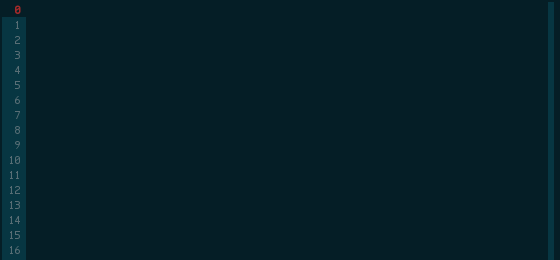

   ``opO`` used to overload operators *+=*, *>>=*, and *>>>=*

``opCmp``
#########

*opCmp* (comparison operator)

   Also in this sample: ret_

``opApply``
###########

*opApply* (*foreach* "operator")

*opApply* implementations usually contain a loop which passes individual elements to the
*foreach*. ``opApply`` generates most of the code to pass the elements, which the user
needs to wrap_ in a loop.

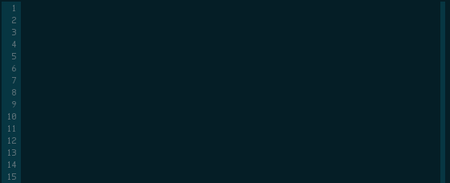

   Also in this sample: fore_

DDoc and comments
^^^^^^^^^^^^^^^^^

bsl_, Ex_, gpl_, Par_, Ret_, See_, Thr_, todo_

----

``todo``
########

TODO comment

.. _Par:
.. _Ret:

``Par``, ``Ret``
################

DDoc *Params*, *Returns*

Must be preceded with ``'/// '`` or ``'* '`` (i.e. single- or multi-line DDoc comments).

``Par`` can be suffixed by a count (1 to 5) of parameters; e.g. ``Par4`` will create
a *Params* section with 4 items.

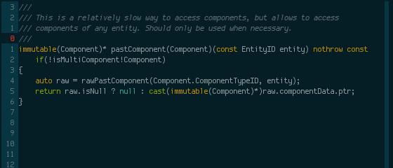

   Document 1 parameter with ``Par`` and the return value with ``Ret``.

----

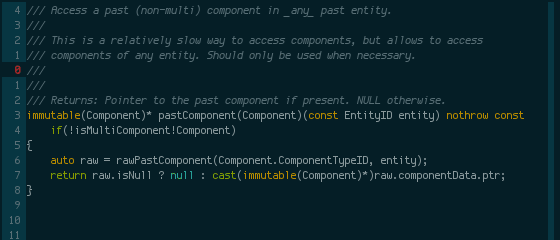

   Document 2 parameters with ``Par2``

``Thr``
#######

DDoc *Throws*

Must be preceded with ``'/// '`` or ``'* '`` (i.e. single- or multi-line DDoc comments).

``Thr`` can be suffixed by a count (1 to 2) of exception types thrown; e.g. ``Thr2``
will create a *Throws* section with 2 items.

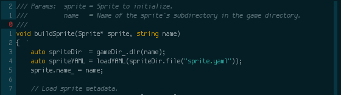

``Ex``
######

DDoc *Example*

Must be preceded with ``'/// '`` or ``'* '`` (i.e. single- or multi-line DDoc comments).

Supports code-wrapping_.

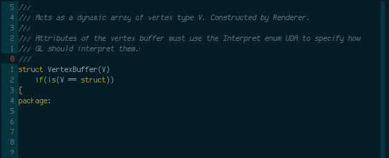

   Also in this sample: struct_

``See``
#######

DDoc *See_Also*

Must be preceded with ``'/// '`` or ``'* '`` (i.e. single- or multi-line DDoc comments).

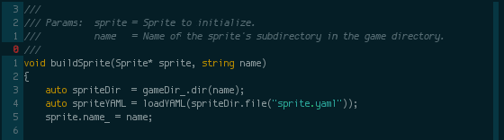

``bsl``
#######

Boost Software License header

``gpl``
#######

GPL2 header

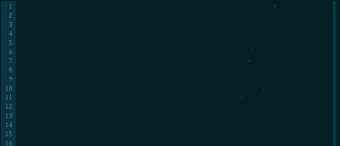

Various
^^^^^^^

avar_, cont_, cvar_, imp_, ivar_, module_, new_, pack_, priv_, prot_, pub_, ret_,
scope_, spn_, supe_, with_

----

``imp``
#######

*import* declaration

.. _avar:
.. _cvar:
.. _ivar:

``module``
##########

*module* header

Uses the file name to set the module name, but package name must be specified by the
user.

Can be combined with gpl_ to specify license (Boost is the default as it is the most
common license for D projects).

   Using the default (Boost) license

----

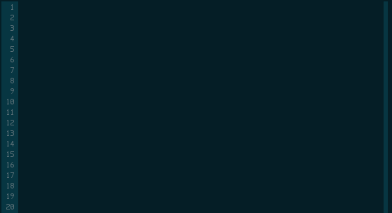

   Also in this sample: gpl_

``avar``, ``cvar``, ``ivar``
############################

*auto* / *const* / *immutable* variable definition

``cont``
########

*continue* statement

``new``
########

*new* (constructor usage) expression

   Also in this sample: avar_

.. _pub:
.. _priv:
.. _prot:
.. _pack:

``pub``, ``priv``, ``prot``, ``pack``
#####################################

*public* / *private* / *protected* / *package*  protection attributes

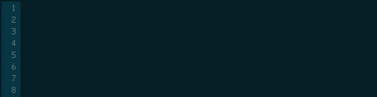

``ret``
#######

*return* statement

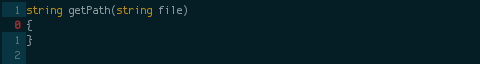

``spn``
#######

builtin function attributes

Creates a sequence of function attributes (*@safe*, *pure*, *nothrow*, *const* and
*@nogc*). Every attribute is a tabstop, making it possible to pick attributes by jumping
between attributes and deleting the unwanted ones. For example, if both the ultisnips
'expand' and 'jump forward' triggers are ``<Tab>``, pressing
``spn<Tab><Tab><Tab><Tab><Tab><Tab>`` (9 keystrokes) will result in *@safe pure nothrow
const @nogc* while ``spn<Tab><Tab><BS><Tab><Tab><BS><Tab><BS><Tab>`` (12 keystrokes)
will produce *@safe nothrow*.

Useful in combination with fun_, this_, operators_ and other snippets that create
functions.

   Also in this sample: ret_

----

   Also in this sample: ret_

``supe``
########

parent constructor call

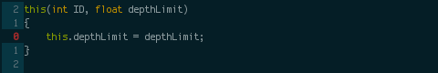

``scope``
#########

*scope* guard

Supports code-wrapping_.

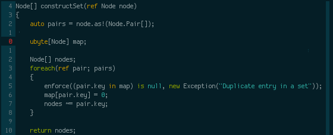

``with``
########

*with* block

Supports code-wrapping_.

   Also in this sample: if_

